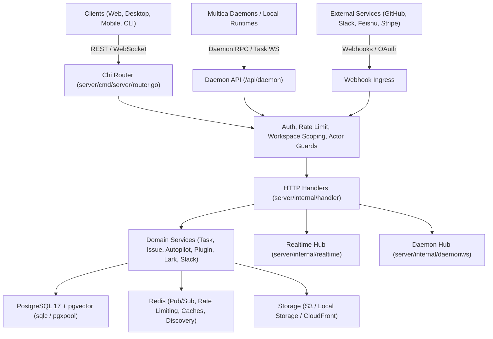

# Multica Backend Architecture Review & API Documentation

## 1. System Architecture Overview

Multica is an AI-native task management platform built around autonomous agents operating as first-class team members alongside human users.

### 1.1 Technical Stack & Core Modules

- **Language & HTTP Framework**: Go 1.26+ with [`github.com/go-chi/chi/v5`](file:///Users/narak/Documents/narakcode/turbo-repo/multica/server/cmd/server/router.go).
- **Database & Query Engine**: PostgreSQL 17 + `pgvector` with [`pgx/v5`](file:///Users/narak/Documents/narakcode/turbo-repo/multica/server/pkg/db) connection pooling and compile-time type-safe queries generated via [`sqlc`](file:///Users/narak/Documents/narakcode/turbo-repo/multica/server/pkg/db/generated).
  - _Hard Constraint_: Application-level integrity with explicit transactions; zero database foreign keys (`FOREIGN KEY` / `REFERENCES`) or cascading triggers.
  - _Indexes_: Non-blocking concurrent index creation (`CREATE INDEX CONCURRENTLY`).
- **Realtime Layer**:
  - **Client Realtime Hub** ([`realtime.Hub`](file:///Users/narak/Documents/narakcode/turbo-repo/multica/server/internal/realtime/hub.go)): WebSocket broadcast hub for live entity mutations, presence, and chat messaging.
  - **Daemon Coordination Hub** ([`daemonws.Hub`](file:///Users/narak/Documents/narakcode/turbo-repo/multica/server/internal/daemonws/hub.go)): WebSocket protocol managing distributed daemon runtimes, task claims, streaming output, and discovery.
- **Enterprise Integrations**: Channel Supervisor ([`engine.Supervisor`](file:///Users/narak/Documents/narakcode/turbo-repo/multica/server/internal/integrations/channel/engine)) driving bidirectional messaging with Feishu/Lark, Slack, DingTalk, WeCom, GitHub Apps, self-hosted VCS (GitLab/Gitea/Forgejo), and Composio.

---

## 2. Authentication & Authorization Model

### 2.1 Credential Schemes

1. **HTTP Session Cookie**: Secure, HTTP-only `SameSite=Strict` cookie populated upon email OTP verification or Google OAuth.
2. **Personal Access Token (PAT)**: Bearer tokens with prefix `mat_...` (`Authorization: Bearer mat_...`).
3. **Daemon Token**: Token for daemon workers to authenticate against `/api/daemon/*`.
4. **Task-Scoped Token**: Ephemeral credential minted for executing agent tasks with least-privilege scoping.
5. **Signed Capability URL**: Short-lived HMAC tokens allowing unauthenticated native asset downloads or public webhook ingress.

### 2.2 Roles & Permission Layers

- **User Scoped**: Account settings, tokens, billing balance (`/api/me`, `/api/tokens`, `/api/cloud-billing`).
- **Workspace Scoped**: Explicitly scoped via `X-Workspace-ID` / `X-Workspace-Slug` or route parameter `/{id}`.
- **Workspace Roles**:
  - `owner`: Workspace deletion, billing subscriptions, seat reconciliations.
  - `admin`: Member roles, invitations, shared MCP catalog, runtime profiles, VCS connections.
  - `member`: Issue tracking, comments, chat sessions, skill executions.
- **Actor Guards**: [`RequireHumanActor`](file:///Users/narak/Documents/narakcode/turbo-repo/multica/server/internal/handler/actor_guards.go) forbids agent task tokens from performing account-level actions (e.g. checkout sessions).

---

## 3. Complete REST API Reference

### 3.1 Public & System Endpoints

| Method | Endpoint                                | Auth             | Description                                                                  |
| :----- | :-------------------------------------- | :--------------- | :--------------------------------------------------------------------------- |
| `GET`  | `/health`                               | None             | Basic liveness health check                                                  |
| `GET`  | `/healthz`, `/readyz`                   | None             | Deep readiness check verifying DB connection                                 |
| `GET`  | `/health/realtime`                      | Token / Loopback | Connection counters, slow-client drops, per-event QPS                        |
| `GET`  | `/api/config`                           | None             | Public instance configuration (signup allowed, integrations active, version) |
| `POST` | `/api/contact-sales`                    | Rate-limited     | Contact sales inquiry form submission                                        |
| `GET`  | `/api/share-links/{code}`               | None             | Preview workspace metadata for an invite code                                |
| `GET`  | `/api/avatars/{sig}/*`                  | Signature        | HMAC-signed public avatar image delivery                                     |
| `GET`  | `/api/attachments/{id}/signed-download` | Signature        | HMAC capability-signed direct attachment download                            |
| `GET`  | `/ws`                                   | Cookie / Token   | Client realtime WebSocket connection                                         |

---

### 3.2 Authentication & User Profile

Defined in [`auth.go`](file:///Users/narak/Documents/narakcode/turbo-repo/multica/server/internal/handler/auth.go).

| Method  | Endpoint                            | Auth                  | Description                                                                     |
| :------ | :---------------------------------- | :-------------------- | :------------------------------------------------------------------------------ |
| `POST`  | `/auth/send-code`                   | Public (Rate-limited) | Sends a 6-digit OTP code to the specified email address                         |
| `POST`  | `/auth/verify-code`                 | Public (Rate-limited) | Verifies email OTP and returns JWT token + user profile                         |
| `POST`  | `/auth/google`                      | Public (Rate-limited) | Exchanges Google OAuth token for login session                                  |
| `POST`  | `/auth/logout`                      | Authenticated         | Revokes current session and clears cookies                                      |
| `GET`   | `/api/me`                           | User                  | Retrieves profile, language preference, timezone, onboarding status             |
| `PATCH` | `/api/me`                           | User                  | Updates user name, avatar URL, language (`en`, `zh-Hans`, `ko`, `ja`), timezone |
| `PATCH` | `/api/me/onboarding`                | User                  | Updates onboarding questionnaire response data                                  |
| `POST`  | `/api/me/onboarding/complete`       | User                  | Marks onboarding flow as finished                                               |
| `POST`  | `/api/me/onboarding/cloud-waitlist` | User                  | Registers user for cloud runtime waitlist                                       |
| `POST`  | `/api/cli-token`                    | User                  | Issues authentication token for Multica CLI                                     |
| `POST`  | `/api/feedback`                     | User                  | Submits user feedback                                                           |
| `POST`  | `/api/client-usage`                 | Human User            | Client telemetry reporting active desktop/web usage                             |

---

### 3.3 Personal Access Tokens & Invitations

Defined in [`personal_access_token.go`](file:///Users/narak/Documents/narakcode/turbo-repo/multica/server/internal/handler/personal_access_token.go) and [`invitation.go`](file:///Users/narak/Documents/narakcode/turbo-repo/multica/server/internal/handler/invitation.go).

| Method   | Endpoint                        | Auth       | Description                                                       |
| :------- | :------------------------------ | :--------- | :---------------------------------------------------------------- |
| `GET`    | `/api/tokens`                   | User       | Lists active Personal Access Tokens for the current user          |
| `POST`   | `/api/tokens`                   | User       | Generates a new PAT (`mat_...`) with optional description and TTL |
| `POST`   | `/api/tokens/current/renew`     | User (PAT) | Renews the expiration timestamp of the calling token              |
| `DELETE` | `/api/tokens/{id}`              | User       | Revokes a Personal Access Token                                   |
| `GET`    | `/api/invitations`              | User       | Lists pending workspace invitations addressed to the user's email |
| `GET`    | `/api/invitations/{id}`         | User       | Retrieves metadata for a specific invitation                      |
| `POST`   | `/api/invitations/{id}/accept`  | User       | Accepts workspace invitation                                      |
| `POST`   | `/api/invitations/{id}/decline` | User       | Declines workspace invitation                                     |
| `POST`   | `/api/share-links/join`         | User       | Joins a workspace via an active share link                        |

---

### 3.4 Workspaces & Members

Defined in [`workspace.go`](file:///Users/narak/Documents/narakcode/turbo-repo/multica/server/internal/handler/workspace.go).

| Method         | Endpoint                                          | Role   | Description                                                |
| :------------- | :------------------------------------------------ | :----- | :--------------------------------------------------------- |
| `GET`          | `/api/workspaces`                                 | User   | Lists all workspaces the user belongs to                   |
| `POST`         | `/api/workspaces`                                 | User   | Creates a new workspace (caller becomes `owner`)           |
| `GET`          | `/api/workspaces/{id}`                            | Member | Gets workspace metadata and caller's permissions           |
| `PUT`, `PATCH` | `/api/workspaces/{id}`                            | Admin  | Updates workspace name, avatar, or slug                    |
| `DELETE`       | `/api/workspaces/{id}`                            | Owner  | Permanently deletes workspace and performs cascade cleanup |
| `GET`          | `/api/workspaces/{id}/members`                    | Member | Lists workspace members and assigned roles                 |
| `POST`         | `/api/workspaces/{id}/members`                    | Admin  | Invites a member by email                                  |
| `PATCH`        | `/api/workspaces/{id}/members/{memberId}`         | Admin  | Updates member role (`admin` or `member`)                  |
| `DELETE`       | `/api/workspaces/{id}/members/{memberId}`         | Admin  | Removes member from workspace                              |
| `POST`         | `/api/workspaces/{id}/leave`                      | Member | Leaves workspace                                           |
| `GET`          | `/api/workspaces/{id}/invitations`                | Member | Lists active pending workspace invitations                 |
| `DELETE`       | `/api/workspaces/{id}/invitations/{invitationId}` | Admin  | Revokes pending invitation                                 |
| `GET`          | `/api/workspaces/{id}/share-links`                | Admin  | Lists active joinable share links                          |
| `POST`         | `/api/workspaces/{id}/share-links`                | Admin  | Creates a new joinable share link                          |
| `DELETE`       | `/api/workspaces/{id}/share-links/{linkId}`       | Admin  | Revokes share link                                         |

---

### 3.5 Issues, Comments & Custom Fields

Defined in [`issue.go`](file:///Users/narak/Documents/narakcode/turbo-repo/multica/server/internal/handler/issue.go) and [`comment.go`](file:///Users/narak/Documents/narakcode/turbo-repo/multica/server/internal/handler/comment.go).

#### Issue Operations

| Method   | Endpoint                         | Description                                                      |
| :------- | :------------------------------- | :--------------------------------------------------------------- |
| `GET`    | `/api/issues`                    | Lists workspace issues with filter and sort query parameters     |
| `POST`   | `/api/issues/query`              | Complex issue querying supporting large facet arrays             |
| `POST`   | `/api/issues/table/groups`       | Groups issues by status, assignee, priority, or project          |
| `POST`   | `/api/issues/table/rows`         | Virtualized table rows for active group                          |
| `POST`   | `/api/issues/table/facets`       | Facet counts for filter popovers                                 |
| `GET`    | `/api/issues/search`             | Full-text search over issue titles and descriptions              |
| `GET`    | `/api/issues/grouped`            | Grouped issue list for Kanban board views                        |
| `GET`    | `/api/issues/child-progress`     | Sub-issue progress aggregation                                   |
| `GET`    | `/api/issues/children`           | Batched sub-issue lookup for parent IDs                          |
| `POST`   | `/api/issues`                    | Creates an issue with polymorphic assignee (`agent` or `member`) |
| `POST`   | `/api/issues/quick-create`       | Rapid inline issue creation                                      |
| `POST`   | `/api/issues/preview-trigger`    | Previews agent/autopilot trigger outcomes before creation        |
| `POST`   | `/api/issues/batch-update`       | Batch updates status, priority, assignee, labels, or project     |
| `POST`   | `/api/issues/batch-delete`       | Batch deletes multiple issues                                    |
| `GET`    | `/api/issues/{id}`               | Retrieves issue by UUID or human-readable ID (e.g. `MUL-123`)    |
| `PUT`    | `/api/issues/{id}`               | Updates issue fields                                             |
| `POST`   | `/api/issues/{id}/move`          | Reorders issue position within group                             |
| `DELETE` | `/api/issues/{id}`               | Deletes an issue                                                 |
| `POST`   | `/api/issues/{id}/rerun`         | Re-executes assigned agent on the issue                          |
| `GET`    | `/api/issues/{id}/timeline`      | Audit log of changes, comments, and status transitions           |
| `GET`    | `/api/issues/{id}/active-task`   | Current active daemon task executing on this issue               |
| `GET`    | `/api/issues/{id}/task-runs`     | Task execution history for this issue                            |
| `GET`    | `/api/issues/{id}/usage`         | Aggregated token usage and compute runtime for the issue         |
| `GET`    | `/api/issues/{id}/pull-requests` | Linked GitHub/VCS pull requests                                  |

#### Subscriptions, Reactions & Custom Properties

| Method   | Endpoint                                   | Description                                |
| :------- | :----------------------------------------- | :----------------------------------------- |
| `GET`    | `/api/issues/{id}/subscribers`             | Lists users subscribed to notifications    |
| `POST`   | `/api/issues/{id}/subscribe`               | Subscribes current user to issue updates   |
| `POST`   | `/api/issues/{id}/unsubscribe`             | Unsubscribes current user                  |
| `POST`   | `/api/issues/{id}/unsubscribe/subtree`     | Unsubscribes from issue and all sub-issues |
| `POST`   | `/api/issues/{id}/reactions`               | Adds emoji reaction to issue               |
| `DELETE` | `/api/issues/{id}/reactions`               | Removes emoji reaction                     |
| `GET`    | `/api/issues/{id}/metadata`                | Lists custom key-value metadata            |
| `PUT`    | `/api/issues/{id}/metadata/{key}`          | Sets metadata key-value pair               |
| `DELETE` | `/api/issues/{id}/metadata/{key}`          | Deletes metadata key                       |
| `PUT`    | `/api/issues/{id}/properties/{propertyId}` | Sets custom property value                 |
| `DELETE` | `/api/issues/{id}/properties/{propertyId}` | Clears custom property value               |

#### Comments & Thread Discussions

| Method   | Endpoint                                    | Description                                               |
| :------- | :------------------------------------------ | :-------------------------------------------------------- |
| `GET`    | `/api/issues/{id}/comments`                 | Lists all comments (including agent thought traces)       |
| `POST`   | `/api/issues/{id}/comments`                 | Creates comment (triggers agent if mentioned or assigned) |
| `POST`   | `/api/issues/{id}/comments/trigger-preview` | Previews agent triggers for comment content               |
| `PUT`    | `/api/comments/{commentId}`                 | Updates comment body                                      |
| `DELETE` | `/api/comments/{commentId}`                 | Deletes comment                                           |
| `POST`   | `/api/comments/{commentId}/resolve`         | Resolves comment discussion thread                        |
| `DELETE` | `/api/comments/{commentId}/resolve`         | Reopens comment thread                                    |
| `POST`   | `/api/comments/{commentId}/reactions`       | Adds emoji reaction to comment                            |
| `DELETE` | `/api/comments/{commentId}/reactions`       | Removes emoji reaction from comment                       |

---

### 3.6 Custom Properties, Labels, Statuses & Quick Actions

Defined in [`property.go`](file:///Users/narak/Documents/narakcode/turbo-repo/multica/server/internal/handler/property.go), [`label.go`](file:///Users/narak/Documents/narakcode/turbo-repo/multica/server/internal/handler/label.go), [`issue_status.go`](file:///Users/narak/Documents/narakcode/turbo-repo/multica/server/internal/handler/issue_status.go), and [`quick_action.go`](file:///Users/narak/Documents/narakcode/turbo-repo/multica/server/internal/handler/quick_action.go).

| Method                 | Endpoint                                                | Role   | Description                                            |
| :--------------------- | :------------------------------------------------------ | :----- | :----------------------------------------------------- |
| `GET`                  | `/api/properties`                                       | Member | Lists custom issue properties                          |
| `POST`                 | `/api/properties`                                       | Member | Creates a new custom issue property                    |
| `GET`, `PATCH`         | `/api/properties/{id}`                                  | Member | Retrieves or updates custom property definition        |
| `GET`, `POST`          | `/api/labels`                                           | Member | Lists or creates workspace labels                      |
| `GET`, `PUT`, `DELETE` | `/api/labels/{id}`                                      | Member | Manages specific label definition                      |
| `GET`                  | `/api/issue-statuses`                                   | Member | Lists workspace issue status workflow catalog          |
| `POST`                 | `/api/issue-statuses`                                   | Admin  | Creates a custom issue status                          |
| `PATCH`, `DELETE`      | `/api/issue-statuses/{id}`                              | Admin  | Modifies or archives issue status                      |
| `GET`, `POST`          | `/api/quick-actions`                                    | Member | Lists or creates reusable issue quick action templates |
| `PATCH`, `DELETE`      | `/api/quick-actions/{id}`                               | Member | Modifies or deletes quick action template              |
| `POST`                 | `/api/issues/{id}/quick-actions/{quickActionId}/run`    | Member | Executes quick action template on issue                |
| `POST`                 | `/api/issues/{id}/quick-actions/{quickActionId}/render` | Member | Renders prompt template preview                        |

---

### 3.7 Agents, Agent Builder & Skills

Defined in [`agent.go`](file:///Users/narak/Documents/narakcode/turbo-repo/multica/server/internal/handler/agent.go), [`agent_builder.go`](file:///Users/narak/Documents/narakcode/turbo-repo/multica/server/internal/handler/agent_builder.go), and [`skill.go`](file:///Users/narak/Documents/narakcode/turbo-repo/multica/server/internal/handler/skill.go).

#### Agent Management

| Method        | Endpoint                                          | Description                                                  |
| :------------ | :------------------------------------------------ | :----------------------------------------------------------- |
| `GET`         | `/api/agents`                                     | Lists workspace agents with live status                      |
| `POST`        | `/api/agents`                                     | Creates a new autonomous agent                               |
| `POST`        | `/api/agents/mika`                                | Initializes Mika (workspace Chief of Staff)                  |
| `GET`         | `/api/agents/{id}`                                | Gets agent configuration, model, system prompt, and bindings |
| `PUT`         | `/api/agents/{id}`                                | Updates agent configuration and runtime binding              |
| `POST`        | `/api/agents/{id}/archive`                        | Archives agent and aborts active executions                  |
| `POST`        | `/api/agents/{id}/restore`                        | Restores archived agent                                      |
| `POST`        | `/api/agents/{id}/cancel-tasks`                   | Cancels all active running tasks on agent                    |
| `GET`         | `/api/agents/{id}/tasks`                          | Lists task execution history                                 |
| `GET`, `PUT`  | `/api/agents/{id}/env`                            | Gets or updates agent environment secrets (audited)          |
| `GET`, `PUT`  | `/api/agents/{id}/skills`                         | Lists or replaces attached skills                            |
| `POST`        | `/api/agents/{id}/skills/add`                     | Attaches additional skills                                   |
| `PUT`         | `/api/agents/{id}/skills/{skillId}/enabled`       | Toggles skill enablement                                     |
| `DELETE`      | `/api/agents/{id}/skills/{skillId}`               | Detaches skill from agent                                    |
| `GET`, `POST` | `/api/agents/{id}/mcp-servers`                    | Lists or attaches workspace MCP servers                      |
| `PUT`         | `/api/agents/{id}/mcp-servers/{serverId}/enabled` | Toggles MCP server enablement                                |
| `DELETE`      | `/api/agents/{id}/mcp-servers/{serverId}`         | Detaches MCP server from agent                               |

#### Agent Builder Studio

| Method  | Endpoint                                          | Description                                     |
| :------ | :------------------------------------------------ | :---------------------------------------------- |
| `GET`   | `/api/agent-builder/sessions`                     | Lists in-progress agent creation draft sessions |
| `POST`  | `/api/agent-builder/sessions`                     | Initiates new interactive agent builder session |
| `PATCH` | `/api/agent-builder/sessions/{sessionId}/runtime` | Switches builder execution runtime              |
| `PUT`   | `/api/agent-builder/sessions/{sessionId}/draft`   | Autosaves in-progress configuration draft       |

#### Skills Library

| Method                 | Endpoint                          | Description                                       |
| :--------------------- | :-------------------------------- | :------------------------------------------------ |
| `GET`, `POST`          | `/api/skills`                     | Lists workspace skills or creates a new skill     |
| `GET`                  | `/api/skills/search`              | Searches skills by name or instructions           |
| `POST`                 | `/api/skills/import`              | Imports packaged skill ZIP archive                |
| `GET`, `PUT`, `DELETE` | `/api/skills/{id}`                | Retrieves, updates, or deletes a skill definition |
| `POST`                 | `/api/skills/{id}/refresh`        | Refreshes skill definition from remote repository |
| `GET`, `PUT`           | `/api/skills/{id}/files`          | Lists or upserts files inside skill bundle        |
| `DELETE`               | `/api/skills/{id}/files/{fileId}` | Deletes file from skill bundle                    |

---

### 3.8 Runtimes & Daemon Coordination

Defined in [`runtime.go`](file:///Users/narak/Documents/narakcode/turbo-repo/multica/server/internal/handler/runtime.go) and [`daemon.go`](file:///Users/narak/Documents/narakcode/turbo-repo/multica/server/internal/handler/daemon.go).

#### Workspace Runtimes & Profiles

| Method                    | Endpoint                                             | Role   | Description                                                   |
| :------------------------ | :--------------------------------------------------- | :----- | :------------------------------------------------------------ |
| `GET`                     | `/api/runtimes`                                      | Member | Lists registered agent runtimes (daemons and cloud fleet)     |
| `PATCH`                   | `/api/runtimes/{runtimeId}`                          | Member | Updates runtime name or settings                              |
| `DELETE`                  | `/api/runtimes/{runtimeId}`                          | Member | Deletes inactive runtime                                      |
| `POST`                    | `/api/runtimes/{runtimeId}/unbind-agents-and-delete` | Member | Atomically unbinds agents, cancels tasks, and deletes runtime |
| `GET`                     | `/api/runtimes/{runtimeId}/usage`                    | Member | Aggregated runtime compute time and token usage               |
| `GET`                     | `/api/runtimes/{runtimeId}/activity`                 | Member | Hourly runtime task execution activity                        |
| `POST`                    | `/api/runtimes/{runtimeId}/update`                   | Member | Requests daemon binary self-update                            |
| `POST`                    | `/api/runtimes/{runtimeId}/models`                   | Member | Triggers local model discovery on runtime machine             |
| `POST`                    | `/api/runtimes/{runtimeId}/local-skills`             | Member | Triggers discovery of local filesystem skills                 |
| `POST`                    | `/api/runtimes/{runtimeId}/local-skills/import`      | Member | Imports discovered local skill into workspace                 |
| `GET`                     | `/api/workspaces/{id}/runtime-profiles`              | Member | Lists custom agent runtime profiles                           |
| `POST`, `PATCH`, `DELETE` | `/api/workspaces/{id}/runtime-profiles/{profileId}`  | Admin  | Manages custom runtime profile settings                       |

#### Daemon Worker Protocol (`/api/daemon/*`)

_Requires [`DaemonAuth`](file:///Users/narak/Documents/narakcode/turbo-repo/multica/server/internal/middleware/daemon_auth.go)._

| Method | Endpoint                                                                | Description                                             |
| :----- | :---------------------------------------------------------------------- | :------------------------------------------------------ |
| `POST` | `/api/daemon/register`                                                  | Registers daemon instance with workspace capabilities   |
| `POST` | `/api/daemon/deregister`                                                | Shuts down daemon connection cleanly                    |
| `POST` | `/api/daemon/heartbeat`                                                 | Periodic heartbeat reporting worker health and capacity |
| `GET`  | `/api/daemon/ws`                                                        | Persistent daemon WebSocket connection                  |
| `POST` | `/api/daemon/tasks/claim`                                               | Batch task claim for worker machines                    |
| `POST` | `/api/daemon/runtimes/{runtimeId}/tasks/{taskId}/prepare-lease`         | Extends task lock during environment preparation        |
| `POST` | `/api/daemon/runtimes/{runtimeId}/tasks/{taskId}/skill-bundles/resolve` | Fetches packaged skill bundles for task execution       |
| `POST` | `/api/daemon/tasks/{taskId}/start`                                      | Transitions task state to `in_progress`                 |
| `POST` | `/api/daemon/tasks/{taskId}/progress`                                   | Streams real-time thoughts and tool execution logs      |
| `POST` | `/api/daemon/tasks/{taskId}/complete`                                   | Marks task as completed                                 |
| `POST` | `/api/daemon/tasks/{taskId}/fail`                                       | Records task execution failure                          |
| `POST` | `/api/daemon/tasks/{taskId}/usage`                                      | Reports token usage and execution cost                  |
| `POST` | `/api/daemon/tasks/{taskId}/messages`                                   | Syncs agent output messages                             |
| `POST` | `/api/daemon/tasks/{taskId}/cancel-ack`                                 | Acknowledges cancellation requested by user             |
| `POST` | `/api/daemon/runtimes/{runtimeId}/recover-orphans`                      | Cleans up orphaned tasks after unexpected restart       |

---

### 3.9 Interactive Chat & Threads

Defined in [`chat.go`](file:///Users/narak/Documents/narakcode/turbo-repo/multica/server/internal/handler/chat.go).

| Method                   | Endpoint                                                          | Description                                         |
| :----------------------- | :---------------------------------------------------------------- | :-------------------------------------------------- |
| `GET`, `POST`            | `/api/chat/sessions`                                              | Lists user's chat sessions or creates a new one     |
| `GET`, `PATCH`, `DELETE` | `/api/chat/sessions/{sessionId}`                                  | Retrieves, updates, or deletes chat session         |
| `PATCH`                  | `/api/chat/sessions/{sessionId}/pin`                              | Pins or unpins session in sidebar                   |
| `PATCH`                  | `/api/chat/sessions/{sessionId}/archive`                          | Archives chat session                               |
| `POST`                   | `/api/chat/sessions/{sessionId}/messages`                         | Sends a message (dispatches task to assigned agent) |
| `GET`                    | `/api/chat/sessions/{sessionId}/messages`                         | Fetches session message history                     |
| `GET`                    | `/api/chat/sessions/{sessionId}/messages/page`                    | Cursor-paginated message history                    |
| `POST`                   | `/api/chat/sessions/{sessionId}/read`                             | Marks chat session as read                          |
| `GET`                    | `/api/chat/sessions/{sessionId}/pending-task`                     | Retrieves active or queued task for session         |
| `DELETE`                 | `/api/chat/sessions/{sessionId}/queued-tasks`                     | Clears pending task queue for session               |
| `POST`                   | `/api/chat/sessions/{sessionId}/queued-tasks/{taskId}/prioritize` | Prioritizes queued message turn                     |
| `GET`, `POST`            | `/api/chat/pinned-agents`                                         | Lists or pins agents for quick chat bar             |
| `DELETE`                 | `/api/chat/pinned-agents/{agentId}`                               | Unpins agent from quick chat bar                    |
| `GET`                    | `/api/chat/history`                                               | Agent-facing channel overview history reader        |
| `GET`                    | `/api/chat/thread`                                                | Agent-facing thread message reader                  |

---

### 3.10 Projects, Squads & Autopilots

Defined in [`project.go`](file:///Users/narak/Documents/narakcode/turbo-repo/multica/server/internal/handler/project.go), [`squad.go`](file:///Users/narak/Documents/narakcode/turbo-repo/multica/server/internal/handler/squad.go), and [`autopilot.go`](file:///Users/narak/Documents/narakcode/turbo-repo/multica/server/internal/handler/autopilot.go).

#### Projects & Resources

| Method                 | Endpoint                                    | Description                                           |
| :--------------------- | :------------------------------------------ | :---------------------------------------------------- |
| `GET`, `POST`          | `/api/projects`                             | Lists or creates workspace projects                   |
| `GET`                  | `/api/projects/search`                      | Searches projects by title                            |
| `GET`, `PUT`, `DELETE` | `/api/projects/{id}`                        | Manages project details and timeline dates            |
| `GET`, `POST`          | `/api/projects/{id}/resources`              | Lists or links project resources (repos, docs, links) |
| `PUT`, `DELETE`        | `/api/projects/{id}/resources/{resourceId}` | Modifies or unlinks project resource                  |

#### Squads (Multi-Agent Teams)

| Method                 | Endpoint                           | Description                                             |
| :--------------------- | :--------------------------------- | :------------------------------------------------------ |
| `GET`, `POST`          | `/api/squads`                      | Lists or creates multi-agent squads with a Leader agent |
| `GET`, `PUT`, `DELETE` | `/api/squads/{id}`                 | Manages squad configuration                             |
| `GET`                  | `/api/squads/{id}/members`         | Lists squad members (Worker agents & humans)            |
| `GET`                  | `/api/squads/{id}/members/status`  | Live execution status of squad members                  |
| `POST`, `DELETE`       | `/api/squads/{id}/members`         | Adds or removes squad members                           |
| `PATCH`                | `/api/squads/{id}/members/role`    | Updates member role in squad                            |
| `POST`                 | `/api/issues/{id}/squad-evaluated` | Records squad leader evaluation event                   |

#### Autopilots & Automation Triggers

| Method                    | Endpoint                                                         | Description                                                |
| :------------------------ | :--------------------------------------------------------------- | :--------------------------------------------------------- |
| `GET`, `POST`             | `/api/autopilots`                                                | Lists or creates recurring/automated autopilot agents      |
| `GET`                     | `/api/autopilots/cron-preview`                                   | Previews upcoming schedule timestamps for cron expressions |
| `GET`, `PATCH`, `DELETE`  | `/api/autopilots/{id}`                                           | Manages autopilot configuration                            |
| `POST`                    | `/api/autopilots/{id}/trigger`                                   | Manually triggers immediate autopilot run                  |
| `GET`                     | `/api/autopilots/{id}/runs`                                      | Lists execution run history                                |
| `GET`                     | `/api/autopilots/{id}/deliveries`                                | Webhook delivery attempt logs                              |
| `POST`                    | `/api/autopilots/{id}/deliveries/{deliveryId}/replay`            | Replays past webhook delivery                              |
| `POST`, `PATCH`, `DELETE` | `/api/autopilots/{id}/triggers/{triggerId}`                      | Manages inbound webhook triggers                           |
| `POST`                    | `/api/autopilots/{id}/triggers/{triggerId}/rotate-webhook-token` | Rotates webhook secret bearer token                        |
| `POST`                    | `/api/webhooks/autopilots/{token}`                               | Public inbound webhook ingress triggering autopilot        |

---

### 3.11 Inbox & Notification Preferences

Defined in [`inbox.go`](file:///Users/narak/Documents/narakcode/turbo-repo/multica/server/internal/handler/inbox.go) and [`notification_preference.go`](file:///Users/narak/Documents/narakcode/turbo-repo/multica/server/internal/handler/notification_preference.go).

| Method                | Endpoint                               | Description                                                   |
| :-------------------- | :------------------------------------- | :------------------------------------------------------------ |
| `GET`                 | `/api/inbox`                           | Lists active notifications for current user                   |
| `GET`                 | `/api/inbox/archived`                  | Lists archived notifications                                  |
| `GET`                 | `/api/inbox/unread-count`              | Unread notification count for current workspace               |
| `GET`                 | `/api/inbox/unread-summary`            | Cross-workspace unread counts for workspace switcher dot      |
| `POST`                | `/api/inbox/mark-all-read`             | Marks all notifications read                                  |
| `POST`                | `/api/inbox/archive-all`               | Archives all notifications                                    |
| `POST`                | `/api/inbox/archive-all-read`          | Archives all read notifications                               |
| `POST`                | `/api/inbox/archive-completed`         | Archives notifications for completed issues                   |
| `POST`                | `/api/inbox/{id}/read`, `unread`       | Toggles read status on single notification                    |
| `POST`                | `/api/inbox/{id}/archive`, `unarchive` | Archives or restores single notification                      |
| `GET`, `PATCH`, `PUT` | `/api/notification-preferences`        | Gets or updates notification matrix (email, in-app, mentions) |

---

### 3.12 Workspace MCP Servers & Plugins

Defined in [`workspace_mcp.go`](file:///Users/narak/Documents/narakcode/turbo-repo/multica/server/internal/handler/workspace_mcp.go) and [`plugin.go`](file:///Users/narak/Documents/narakcode/turbo-repo/multica/server/internal/handler/plugin.go).

| Method                  | Endpoint                                                                     | Role   | Description                                 |
| :---------------------- | :--------------------------------------------------------------------------- | :----- | :------------------------------------------ |
| `GET`                   | `/api/workspaces/{id}/mcp-servers`                                           | Member | Lists shared workspace MCP servers          |
| `POST`, `PUT`, `DELETE` | `/api/workspaces/{id}/mcp-servers/{serverId}`                                | Admin  | Manages shared workspace MCP server catalog |
| `GET`                   | `/api/workspaces/{id}/plugins`                                               | Member | Lists installed workspace plugins           |
| `GET`                   | `/api/workspaces/{id}/plugins/catalog`                                       | Member | Lists available marketplace plugins         |
| `GET`                   | `/api/workspaces/{id}/plugins/private`                                       | Member | Lists installed private plugins             |
| `POST`                  | `/api/workspaces/{id}/plugins/install`                                       | Admin  | Installs plugin from catalog                |
| `POST`                  | `/api/workspaces/{id}/plugins/private/install`                               | Admin  | Installs private plugin archive             |
| `POST`                  | `/api/workspaces/{id}/plugins/{installationId}/upgrade`                      | Admin  | Upgrades installed plugin                   |
| `POST`                  | `/api/workspaces/{id}/plugins/{installationId}/enable`                       | Admin  | Enables plugin                              |
| `POST`                  | `/api/workspaces/{id}/plugins/{installationId}/disable`                      | Admin  | Disables plugin                             |
| `DELETE`                | `/api/workspaces/{id}/plugins/{installationId}`                              | Admin  | Uninstalls plugin                           |
| `PUT`                   | `/api/workspaces/{id}/plugins/{installationId}/remote-mcp/{key}/config`      | Admin  | Configures Remote MCP tool settings         |
| `POST`                  | `/api/workspaces/{id}/plugins/{installationId}/remote-mcp/{key}/oauth/start` | Admin  | Begins Remote MCP OAuth flow                |
| `POST`                  | `/api/workspaces/{id}/plugins/{installationId}/remote-mcp/{key}/test`        | Admin  | Tests Remote MCP connectivity               |
| `POST`                  | `/api/workspaces/{id}/plugins/{installationId}/remote-mcp/{key}/approve`     | Admin  | Approves discovered Remote MCP tools        |
| `DELETE`                | `/api/workspaces/{id}/plugins/{installationId}/remote-mcp/{key}/credential`  | Admin  | Revokes stored Remote MCP credentials       |

---

### 3.13 Integrations (GitHub, VCS, Channels, Composio)

| Integration          | Endpoints                                                                                                                                                                                                                                        | Description                                                                  |
| :------------------- | :----------------------------------------------------------------------------------------------------------------------------------------------------------------------------------------------------------------------------------------------- | :--------------------------------------------------------------------------- |
| **GitHub App**       | `POST /api/webhooks/github` `GET /api/workspaces/{id}/github/installations` `GET /api/workspaces/{id}/github/connect` `DELETE /api/workspaces/{id}/github/installations/{installationId}`                                               | Inbound webhook handling, app connection, repo syncing, and disconnection.   |
| **Self-Hosted VCS**  | `POST /api/webhooks/vcs/{connectionId}` `POST /api/workspaces/{id}/vcs/connections` `POST /api/workspaces/{id}/vcs/connections/{connectionId}/rotate-webhook` `DELETE /api/workspaces/{id}/vcs/connections/{connectionId}`              | GitLab, Gitea, and Forgejo webhook listener and connection management.       |
| **Feishu / Lark**    | `GET /api/workspaces/{id}/lark/installations` `POST /api/workspaces/{id}/lark/install/begin` `GET /api/workspaces/{id}/lark/install/{sessionId}/status` `POST /api/lark/binding/redeem`                                                 | QR-code device flow installation and user identity binding.                  |
| **Slack BYO**        | `GET /api/workspaces/{id}/slack/installations` `POST /api/workspaces/{id}/slack/install/byo` `POST /api/slack/binding/redeem`                                                                                                              | Custom Slack App token registration and user account binding.                |
| **DingTalk & WeCom** | `POST /api/workspaces/{id}/dingtalk/install/byo` `POST /api/workspaces/{id}/wecom/install/byo` `POST /api/dingtalk/binding/redeem` `POST /api/wecom/binding/redeem`                                                                     | Bring-your-own bot configuration and user binding endpoints.                 |
| **Composio**         | `POST /api/integrations/composio/connect/init` `GET /api/integrations/composio/toolkits` `GET /api/integrations/composio/connections` `DELETE /api/integrations/composio/connections/{id}` `GET /api/integrations/composio/callback` | OAuth connect initialization and tool authorization for 200+ app connectors. |

---

### 3.14 Cloud Billing & Subscriptions

Defined in [`cloud_billing.go`](file:///Users/narak/Documents/narakcode/turbo-repo/multica/server/internal/handler/cloud_billing.go). Enforces [`RequireHumanActor`](file:///Users/narak/Documents/narakcode/turbo-repo/multica/server/internal/handler/actor_guards.go).

| Method | Endpoint                                     | Role   | Description                                           |
| :----- | :------------------------------------------- | :----- | :---------------------------------------------------- |
| `POST` | `/api/webhooks/stripe`                       | Public | Stripe raw signature webhook handler                  |
| `GET`  | `/api/cloud-billing/balance`                 | User   | Account credit balance and usage limit                |
| `GET`  | `/api/cloud-billing/transactions`            | User   | Token credit purchase and deduction ledger            |
| `GET`  | `/api/cloud-billing/price-tiers`             | User   | Available top-up credit pricing tiers                 |
| `POST` | `/api/cloud-billing/checkout-sessions`       | User   | Creates Stripe Checkout session for credit top-up     |
| `POST` | `/api/cloud-billing/portal-sessions`         | User   | Creates Stripe Customer Portal session                |
| `GET`  | `/api/cloud-subscriptions/entitlements`      | Member | Workspace plan tier and active limits                 |
| `GET`  | `/api/cloud-subscriptions/summary`           | Member | Active seat count, renewal dates, and invoice summary |
| `POST` | `/api/cloud-subscriptions/checkout-sessions` | Admin  | Upgrades workspace subscription plan                  |
| `POST` | `/api/cloud-subscriptions/seats/reconcile`   | Admin  | Syncs billable seats with active member count         |
| `POST` | `/api/cloud-subscriptions/portal-sessions`   | Admin  | Stripe Customer Portal for subscription management    |

---

### 3.15 Attachments & File Storage

Defined in [`file.go`](file:///Users/narak/Documents/narakcode/turbo-repo/multica/server/internal/handler/file.go).

| Method   | Endpoint                         | Auth               | Description                                                   |
| :------- | :------------------------------- | :----------------- | :------------------------------------------------------------ |
| `POST`   | `/api/upload-file`               | User / Agent       | Multipart upload for images, videos, PDFs, and skill archives |
| `GET`    | `/api/attachments/{id}`          | Member             | Attachment metadata and signed direct download URL            |
| `GET`    | `/api/attachments/{id}/download` | User (Self-scoped) | Direct download endpoint (embeddable in markdown ``)     |
| `GET`    | `/api/attachments/{id}/content`  | Member             | Raw byte content delivery                                     |
| `DELETE` | `/api/attachments/{id}`          | Member             | Deletes attachment from storage and database                  |

---

### 3.16 Dashboard & Presence Analytics

Defined in [`dashboard.go`](file:///Users/narak/Documents/narakcode/turbo-repo/multica/server/internal/handler/dashboard.go).

| Method | Endpoint                           | Description                                                    |
| :----- | :--------------------------------- | :------------------------------------------------------------- |
| `GET`  | `/api/dashboard/usage/daily`       | Workspace daily LLM token consumption breakdown                |
| `GET`  | `/api/dashboard/usage/by-agent`    | LLM token usage aggregated by agent                            |
| `GET`  | `/api/dashboard/runtime/daily`     | Total agent compute execution time per day                     |
| `GET`  | `/api/dashboard/failures/daily`    | Task failure rates and error classification counts             |
| `GET`  | `/api/dashboard/failures/by-agent` | Failure counts per agent                                       |
| `GET`  | `/api/agent-task-snapshot`         | Live snapshot of all currently active agent tasks              |
| `GET`  | `/api/working-agents`              | Active agents currently executing tasks in workspace           |
| `GET`  | `/api/agent-activity-30d`          | Trailing 30-day activity sparklines for all agents             |
| `GET`  | `/api/agent-run-counts`            | 30-day total run counts per agent                              |
| `GET`  | `/api/assignee-frequency`          | Frequency distribution of issue assignees for quick assignment |

---

## 4. WebSocket Realtime Protocol

### Client Event Bus (`GET /ws`)

Clients connect via WebSocket and receive JSON broadcast frames scoped by workspace:

- **Issue Updates**: `issue:created`, `issue:updated`, `issue:deleted`, `issue:moved`
- **Comment Updates**: `comment:created`, `comment:updated`, `comment:deleted`
- **Task Lifecycle**: `task:started`, `task:progress`, `task:completed`, `task:failed`, `task:cancelled`
- **Agent & Runtime State**: `agent:updated`, `runtime:status_changed`
- **Inbox & Presence**: `inbox:new_item`, `presence:sync`
